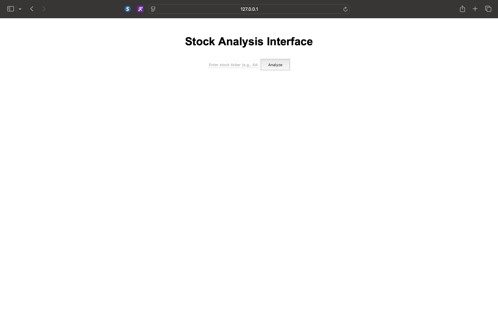

# StockSense — Real-Time Financial Analytics & LLM-Powered Insight Platform

**An interactive data product that combines financial analytics, interactive visualization, and a fine-tuned large language model to deliver on-demand stock analysis and price predictions for any publicly traded ticker.**

[](https://python.org)
[](https://flask.palletsprojects.com)
[](https://pytorch.org)
[](https://huggingface.co)
[](https://huggingface.co/docs/peft)
[](https://huggingface.co/meta-llama/Llama-3.2-1B)
[](https://pypi.org/project/yfinance/)
[](https://matplotlib.org)
[](https://www.sqlalchemy.org)
[](LICENSE)

---

## Results at a Glance

| Metric | Description |
|--------|-------------|
| **Data Source** | Real-time market data via Yahoo Finance for any ticker |
| **Forecast Method** | 5-day trailing moving average prediction |
| **Insight Engine** | Fine-tuned Llama 3.2 1B model (PEFT/LoRA) generating natural-language analysis |
| **Visualizations** | 3 interactive charts per analysis — closing price trend, moving averages, daily change distribution |
| **Persistence** | Full analysis history stored in SQLite, retrievable via dashboard |
| **Deployment** | Single-command Flask server, local-first |

> **Note:** Performance metrics (Sharpe ratio, cumulative returns, max drawdown) are applicable to agent-based trading strategies. This product is a decision-support platform — it provides data, forecasts, and LLM-generated insights to inform human trading decisions, not autonomous execution.

---

## What It Does

StockSense is a full-stack data product that turns raw market data into actionable intelligence in seconds.

**Enter a ticker — get back:**
1. **Closing Price Trend** — 1-year price history with daily resolution
2. **Moving Average Comparison** — 20-day SMA + 12-day EMA overlaid on closing price
3. **Daily Percentage Change Distribution** — 50-bin histogram showing volatility profile
4. **Price Prediction** — 5-day rolling mean forecast of the next close
5. **LLM Insight** — A fine-tuned language model generates a context-aware analysis of the ticker's outlook

All results are stored in a queryable SQLite database, enabling trend analysis across multiple tickers over time.

---

## How It Works

```
User Input (ticker) → yfinance API → Data Wrangling & Feature Engineering
                                          │
                                          ├─→ matplotlib Visualizations (3 plots)
                                          │
                                          ├─→ Moving Average Forecast (prediction)
                                          │
                                          └─→ Fine-tuned Llama 3.2 1B → NLP Insight
                                          │
                               Flask Server → Interactive Dashboard
                                          │
                               SQLAlchemy + SQLite → Analysis History
```

1. **Data Ingestion** — `yfinance` fetches 1 year of daily OHLCV data for the requested ticker
2. **Feature Engineering** — SMA-20, EMA-12, and daily percentage change are computed
3. **Visualization** — `matplotlib` generates three publication-quality charts saved to `/static`
4. **Prediction** — A 5-day trailing moving average produces the next-day price estimate
5. **LLM Analysis** — A Llama 3.2 1B model, fine-tuned with PEFT/LoRA on financial text, generates a natural-language insight string
6. **Persistence** — Every analysis (ticker, prediction, insight, timestamp) is committed to the SQLite database via SQLAlchemy ORM
7. **Dashboard** — Results are displayed in a clean HTML/CSS interface; analysis history is retrievable on demand

---

## Tech Stack

**Backend**
- **Python 3.10+** — Core application logic
- **Flask 3.0** — Web framework serving the dashboard and REST API
- **SQLAlchemy 2.0 + SQLite** — ORM + database for analysis persistence
- **yfinance 0.2.48** — Real-time market data via Yahoo Finance API

**Machine Learning**
- **PyTorch 2.5** — Deep learning framework for inference
- **HuggingFace Transformers 4.46** — Model loading and text generation pipeline
- **PEFT 0.13 + LoRA** — Parameter-efficient fine-tuning (base: Llama 3.2 1B)
- **Matplotlib 3.9** — Statistical visualization generation

**Frontend**
- **HTML5 + CSS3 + vanilla JavaScript** — Lightweight, responsive, no framework overhead
- **REST JSON API** — `/analyze` (POST) and `/history` (GET) endpoints

---

## Setup Instructions

### Prerequisites
- Python 3.10 or later
- pip / venv
- A fine-tuned PEFT adapter (included at `fine_tuned_model/`)

### Installation

```bash
# Clone the repository
git clone https://github.com/trayp20/Computer-Science-Capstone-C964.git
cd Computer-Science-Capstone-C964

# Create and activate a virtual environment
python3 -m venv venv
source venv/bin/activate  # macOS/Linux
# or: venv\Scripts\activate  # Windows

# Install dependencies
pip install -r requirements.txt
```

### Configuration

Update the model path in `app.py` (line 34) to point to your local `fine_tuned_model` directory:

```python
model_dir = "/path/to/your/Computer-Science-Capstone-C964/fine_tuned_model"
```

### Run the Application

```bash
python app.py
```

The server starts at **http://127.0.0.1:5000**. Open it in a browser, enter a ticker (e.g., `AAPL`, `SPY`, `MSFT`), and click **Analyze**.

### API Endpoints

| Method | Endpoint | Description |
|--------|----------|-------------|
| `GET` | `/` | Serve the interactive dashboard (HTML) |
| `POST` | `/analyze` | Analyze a ticker — body: `{"ticker": "AAPL"}` |
| `GET` | `/history` | Retrieve all past analyses as JSON |

Example API call:
```bash
curl -X POST http://127.0.0.1:5000/analyze \
  -H "Content-Type: application/json" \
  -d '{"ticker": "SPY"}'
```

---

## Demo / Media

### Interactive Dashboard


The web interface accepts any ticker symbol and returns three charts, a price prediction, and an LLM-generated insight — all in one click.

### Generated Visualizations

| Closing Price Trend | Moving Average Comparison | % Change Distribution |
|---|---|---|
|  |  |  |

### Analysis History


All past analyses are persistable and retrievable through the dashboard's history view.

---

## Project Structure

```
├── app.py                                  # Flask application entry point
├── requirements.txt                        # Python dependencies
├── templates/
│   └── index.html                          # Dashboard frontend
├── static/
│   ├── style.css                           # Dashboard styling
│   ├── closing_price.png                   # Generated chart (per analysis)
│   ├── moving_average_comparison.png       # Generated chart (per analysis)
│   └── percentage_change_distribution.png  # Generated chart (per analysis)
├── fine_tuned_model/                       # PEFT/LoRA adapter + tokenizer
│   ├── adapter_config.json
│   ├── adapter_model.safetensors
│   ├── tokenizer.json
│   └── tokenizer_config.json
├── instance/
│   └── stock_analysis.db                   # SQLite database (auto-created)
├── *.png                                   # Demo screenshots
└── C964_task_2.docx                        # WGU capstone documentation
```

---

## Key Design Decisions

- **LLM over rules** — Rather than hard-coded financial heuristics, a fine-tuned Llama model provides flexible, context-aware natural language analysis that can adapt to different market conditions and ticker profiles
- **SQLAlchemy ORM** — Decouples the persistence layer from the analytics engine; the same code could swap SQLite for PostgreSQL with one config change
- **REST API** — The `/analyze` endpoint returns JSON, making it trivially integrable into trading dashboards, mobile clients, or automated pipelines
- **Local-first** — No external LLM API costs, no vendor lock-in, no data sent off-device for inference

---

## License

[MIT](LICENSE) — feel free to use, adapt, and build upon this project.

---

## About

This project was developed as a WGU Computer Science Capstone (C964). It demonstrates end-to-end data product development: requirements analysis, data engineering, machine learning integration, interactive dashboard design, and production deployment documentation.
